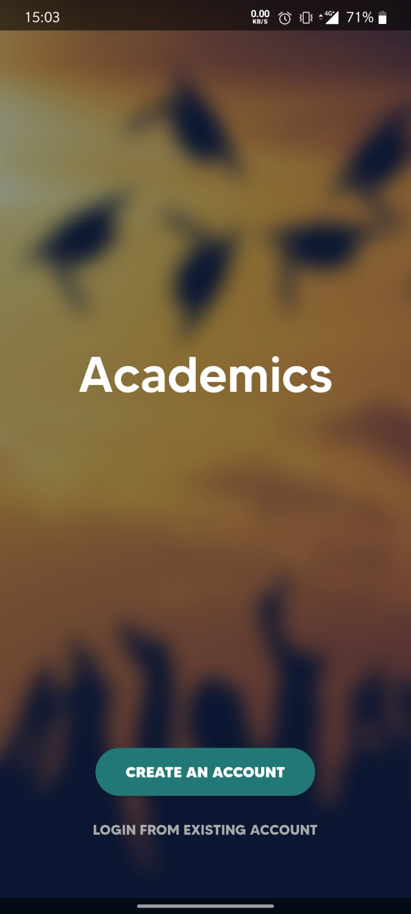
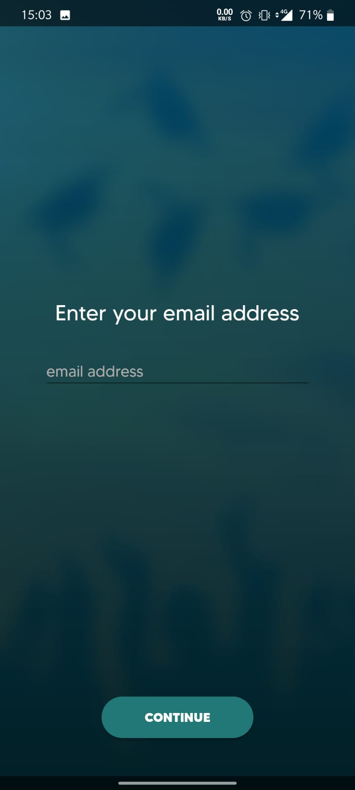
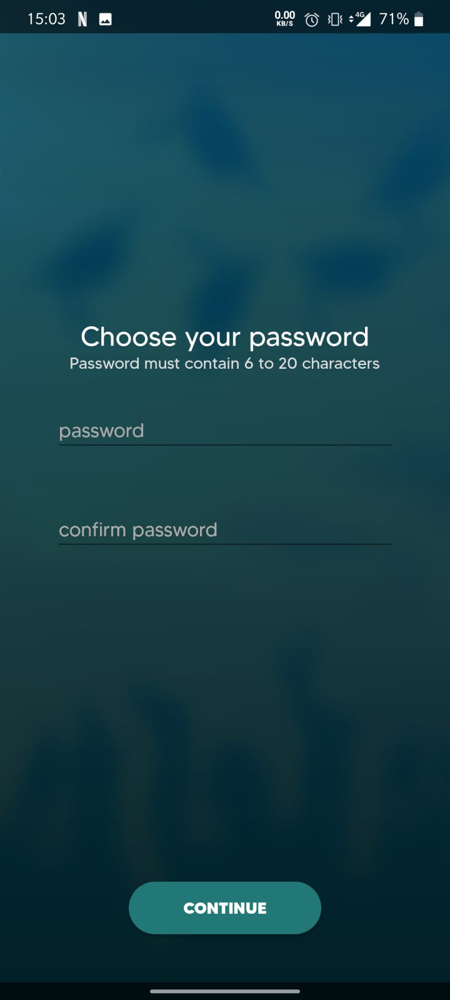
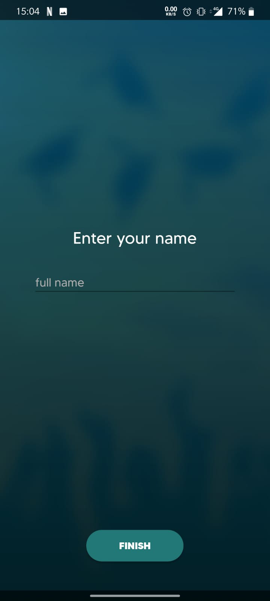
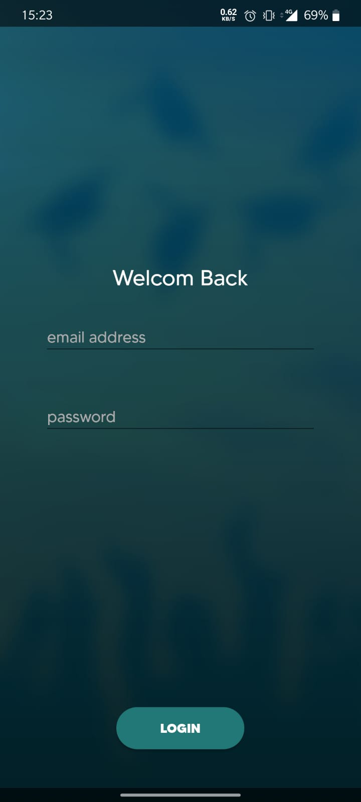

Academics
=================

Academics is a social app for students all around the world.
In Academics, students can ask questions, share suggestions, socialize with one another, and find help.

Introduction
------------

The idea behind Academics is that during the COVID-19 time, students have a hard time studying in online lectures.
So Academics helps students gather good and reliable material to study from (Like course summaries or, if needed, tests from previous years and different institutions),
and connects between students who need help and those who can provide help.

Installation Instructions
---------------

There are two ways to install the application:

The first one is to download the Academics.apk to your android device and install it. (It's that simple.)

The second method is to download the source code and run it in android studio.
We suggest you install the application using the first method since the second one might be not reliable (you need to have Android Studio and a configured SDK in your system)

Both the APK and the source code can be found in our repository. The APK file is named "Academics.apk" and the source code it the folder named "Source Code".

Getting Started
---------------
To enter Academics you first need to sign up.
The registration process requires an email, a password, and a display name that will be shown to other users.
It is recommended to use your full name as a display name.

   

After you register, academics will keep you logged in, but if you want to login to your account from a different device just press login and enter your info as shown below:

 
 
Academics features
-----------------

The main feature of the app is the ability to share a post with others who may be interested in it.
The way we accomplished it is by making a hierarchy of folders containing faculty->department->course.
To share your post you need to select a folder where the post will be.
We have five types of posts:

-Question - this post can sit in any folder, it will contain text or maybe an image that helps you describes your question. Using our comment section, people can answer your question, ask a continuing question, or get more understanding of what you meant.

-Suggestion - this post can sit in any folder, it will contain something you think can be helpful to other users of the app. It can be a suggestion for a course, a studying method that you find helpful, or even a link to a video explaining a topic very well.

-Test - This post can sit only in a course folder, this post is a pdf file of a test in the course where the post can be found. The test can be from previous years, from different institutions, or anything that may help other students who have a hard time studying for their exams.

-Summary - This post can sit only in a course folder, this post is a pdf file of a summary for the course where the post can be found.
The summary can be any type of summary(a one a student wrote, one the professor wrote, or the one found in the syllabus) that may help other students who have a hard time understanding the material or for those who just want to know if they want to take the course.

-Social - a joke, a confession, or anything you can share that will help relieve the stress other students have during these hard times. This post can sit in any folder.

Along with the posting system, we have a comment section where people can answer and respond to the post and other comments of the same post.
 
Other minor features are:
 - Saving a folder to your Favorite Folders list so you don't have to look for that folder later.
 - Searching a folder in your Favorite Folders list
 - Sharing clickable links in a post.
 - Viewing all the posts you have posted by viewing your profile.
 - Viewing all the posts another user has posted by clicking on his name on a post of his you have seen.
 - Filtering posts by the five types. (Question, Suggestion, Test, Summary, Social)
 - Searcing for keywords that will result in folders and post the server saw fit to show you.
 - Displaying post the server thought you might like.
 
 
Libraries Used
--------------

For http request - Retrofit.

For database - Room.

For image loading - Glide.

Photo View - 'com.github.chrisbanes:PhotoView:2.3.0'

Material SearchBar - 'com.github.mancj:MaterialSearchBar:0.8.5'

 
Future Features
--------------

- Support for multiple languages.
- A web page for those who can't download the application.
- Sharing posts via a link that will open the application or the web page.
- Profile Search by name.
- Custom tags for posts.
